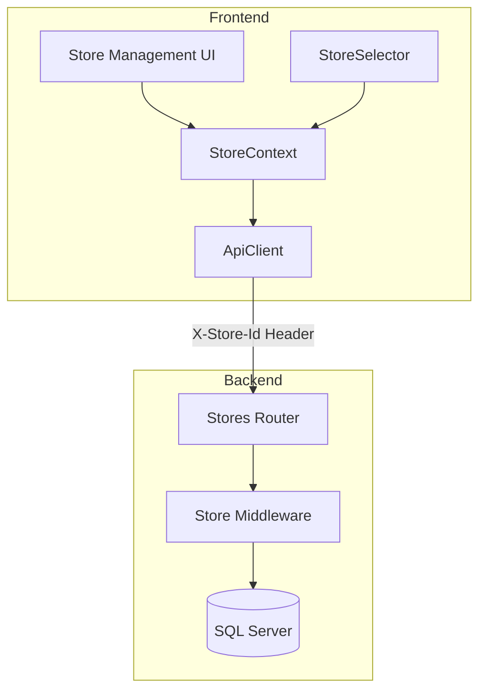

# Design Document: Multi-Store Management

## Overview

Tính năng quản lý nhiều cửa hàng cho phép người dùng tạo, quản lý và chuyển đổi giữa nhiều cửa hàng. Hệ thống hiện tại đã có cơ sở với `StoreContext`, `StoreSelector` và bảng `UserStores`. Design này mở rộng để hoàn thiện các tính năng còn thiếu.

## Architecture



## Components and Interfaces

### 1. Frontend Components

#### StoreManagementPage (`/stores`)
Trang quản lý danh sách cửa hàng cho owner.

```typescript
interface StoreManagementPageProps {
  // No props - uses StoreContext
}

// Features:
// - List all stores user owns
// - Create new store button
// - Edit/Deactivate actions per store
```

#### CreateStoreDialog
Dialog tạo cửa hàng mới.

```typescript
interface CreateStoreDialogProps {
  open: boolean;
  onOpenChange: (open: boolean) => void;
  onStoreCreated: (store: Store) => void;
}

interface CreateStoreFormData {
  name: string;
  description?: string;
  address?: string;
  phone?: string;
  businessType?: string;
}
```

#### EditStoreDialog
Dialog chỉnh sửa thông tin cửa hàng.

```typescript
interface EditStoreDialogProps {
  store: Store;
  open: boolean;
  onOpenChange: (open: boolean) => void;
  onStoreUpdated: (store: Store) => void;
}
```

#### StoreSelector (Existing - Enhanced)
Component chọn cửa hàng đã có, cần thêm link đến trang quản lý.

### 2. Backend API Endpoints

#### POST /api/stores
Tạo cửa hàng mới.

```typescript
// Request
interface CreateStoreRequest {
  name: string;
  description?: string;
  address?: string;
  phone?: string;
  businessType?: string;
}

// Response
interface CreateStoreResponse {
  id: string;
  ownerId: string;
  name: string;
  slug: string;
  description?: string;
  address?: string;
  phone?: string;
  businessType?: string;
  status: 'active';
  createdAt: string;
}
```

#### PUT /api/stores/:id
Cập nhật thông tin cửa hàng.

```typescript
// Request
interface UpdateStoreRequest {
  name?: string;
  description?: string;
  address?: string;
  phone?: string;
  businessType?: string;
  status?: 'active' | 'inactive';
}
```

#### DELETE /api/stores/:id
Vô hiệu hóa cửa hàng (soft delete).

#### DELETE /api/stores/:id/permanent
Xóa vĩnh viễn cửa hàng (hard delete).

```typescript
// Response
interface DeleteStoreResponse {
  success: boolean;
  message: string;
  deletedData?: {
    products: number;
    orders: number;
    customers: number;
  };
}
```

**Lưu ý:** Endpoint này sẽ:
- Xóa tất cả dữ liệu liên quan (UserStores, Products, Orders, Customers, etc.)
- Yêu cầu xác nhận qua query param `?confirm=true`
- Chỉ owner mới có quyền thực hiện

### 3. Store Context Enhancement

```typescript
interface StoreContextType {
  // Existing
  currentStore: Store | null;
  stores: Store[];
  user: StoreUser | null;
  isLoading: boolean;
  error: string | null;
  switchStore: (storeId: string) => void;
  refreshStores: () => Promise<void>;
  logout: () => Promise<void>;
  
  // New
  createStore: (data: CreateStoreFormData) => Promise<Store>;
  updateStore: (id: string, data: Partial<Store>) => Promise<Store>;
  deactivateStore: (id: string) => Promise<void>;
  deleteStorePermanently: (id: string) => Promise<void>; // Hard delete
}
```

## Data Models

### Stores Table (Existing)
```sql
CREATE TABLE Stores (
    id UNIQUEIDENTIFIER PRIMARY KEY DEFAULT NEWID(),
    owner_id UNIQUEIDENTIFIER NOT NULL,
    name NVARCHAR(255) NOT NULL,
    slug NVARCHAR(255) UNIQUE,
    description NTEXT,
    logo_url NVARCHAR(500),
    address NVARCHAR(500),
    phone NVARCHAR(50),
    business_type NVARCHAR(100),
    domain NVARCHAR(255),
    status NVARCHAR(20) DEFAULT 'active',
    settings NVARCHAR(MAX),
    created_at DATETIME2 DEFAULT GETDATE(),
    updated_at DATETIME2 DEFAULT GETDATE(),
    FOREIGN KEY (owner_id) REFERENCES Users(id)
);
```

### UserStores Table (Existing)
```sql
CREATE TABLE UserStores (
    id UNIQUEIDENTIFIER PRIMARY KEY DEFAULT NEWID(),
    user_id UNIQUEIDENTIFIER NOT NULL,
    store_id UNIQUEIDENTIFIER NOT NULL,
    role NVARCHAR(50) DEFAULT 'member',
    created_at DATETIME2 DEFAULT GETDATE(),
    FOREIGN KEY (user_id) REFERENCES Users(id),
    FOREIGN KEY (store_id) REFERENCES Stores(id),
    UNIQUE (user_id, store_id)
);
```

### Store Interface (Frontend)
```typescript
interface Store {
  id: string;
  ownerId: string;
  name: string;
  slug?: string;
  description?: string;
  logoUrl?: string;
  address?: string;
  phone?: string;
  businessType?: string;
  domain?: string;
  status: 'active' | 'inactive';
  settings?: Record<string, unknown>;
  createdAt: string;
  updatedAt: string;
}
```

## Error Handling

| Error Code | Condition | Message |
|------------|-----------|---------|
| 400 | Missing required fields | "Tên cửa hàng là bắt buộc" |
| 400 | Name too long (>255 chars) | "Tên cửa hàng không được quá 255 ký tự" |
| 400 | Missing X-Store-Id header | "Store ID is required" |
| 400 | Missing confirm param for hard delete | "Vui lòng xác nhận xóa vĩnh viễn" |
| 403 | User not owner of store | "Bạn không có quyền quản lý cửa hàng này" |
| 403 | User not assigned to store | "Bạn không có quyền truy cập cửa hàng này" |
| 404 | Store not found | "Không tìm thấy cửa hàng" |
| 409 | Duplicate slug | "Slug cửa hàng đã tồn tại" |

### DeleteStoreDialog Component
Dialog xác nhận xóa vĩnh viễn cửa hàng.

```typescript
interface DeleteStoreDialogProps {
  store: Store | null;
  open: boolean;
  onOpenChange: (open: boolean) => void;
  onDeleted: () => void;
}

// Features:
// - Warning message về việc xóa vĩnh viễn
// - Hiển thị số lượng dữ liệu sẽ bị xóa (products, orders, etc.)
// - Yêu cầu nhập tên cửa hàng để xác nhận
// - Button xóa màu đỏ với loading state
```

## Testing Strategy

### Unit Tests
- Store validation functions
- Slug generation from store name
- Store context state management

### Integration Tests
- Create store API endpoint
- Update store API endpoint
- Store access control (UserStores)

### E2E Tests
- Create new store flow
- Switch between stores
- Edit store information
- Deactivate store

## UI/UX Flow

```mermaid
flowchart TD
    A[User logged in] --> B{Has stores?}
    B -->|No| C[Show Create Store prompt]
    B -->|Yes| D[Show StoreSelector in header]
    
    D --> E[Click StoreSelector]
    E --> F[Dropdown shows all stores]
    F --> G[Select different store]
    G --> H[Context updates, data reloads]
    
    D --> I[Click "Quản lý cửa hàng"]
    I --> J[Store Management Page]
    J --> K[List of owned stores]
    K --> L[Create/Edit/Deactivate actions]
```
