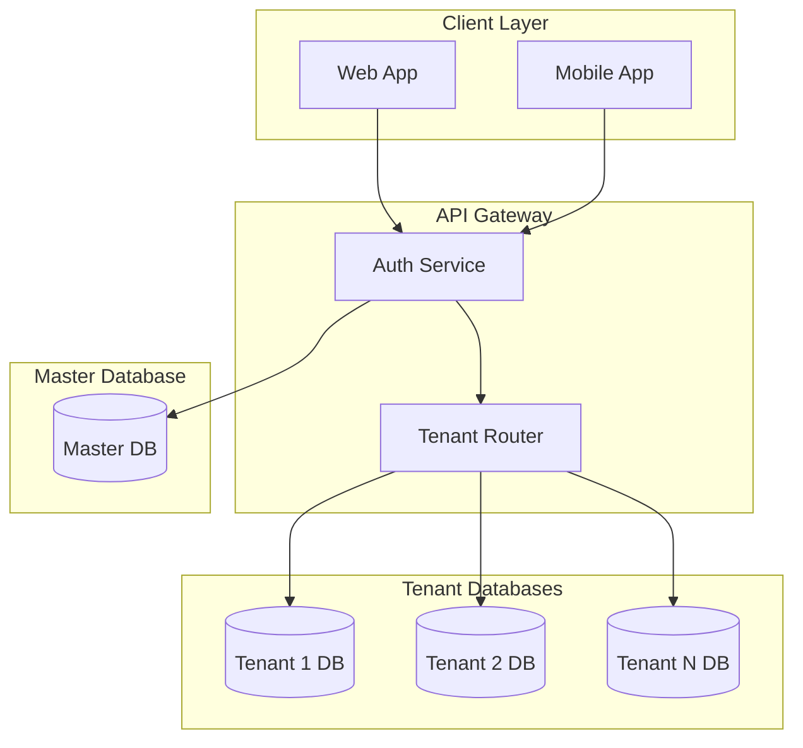
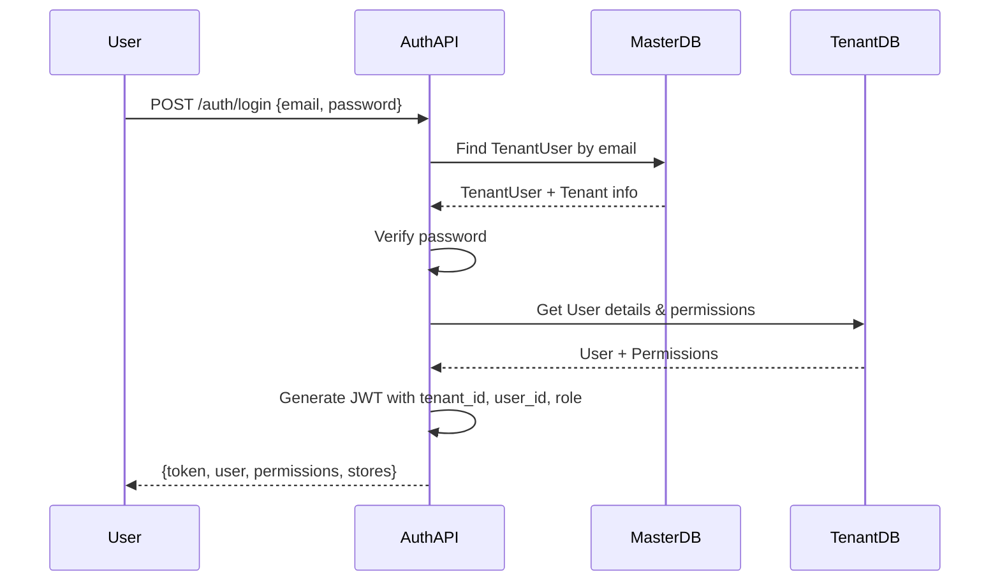

# Design Document: Multi-tenant RBAC System

## Overview

Thiết kế hệ thống Multi-tenant với phân quyền theo cấp bậc (RBAC) cho SmartInventory. Hệ thống sử dụng kiến trúc Database-per-Tenant để đảm bảo isolation hoàn toàn giữa các khách hàng.

## Architecture

### High-Level Architecture



### Database Strategy

**Master Database** chứa:
- Tenants (thông tin tenant)
- TenantUsers (mapping user -> tenant)
- TenantDatabases (connection strings)
- SubscriptionPlans (gói dịch vụ)

**Tenant Database** (mỗi tenant 1 database) chứa:
- Users (tài khoản trong tenant)
- Stores (cửa hàng)
- UserStores (phân quyền user-store)
- Roles & Permissions
- Business data (Products, Sales, Customers, etc.)

## Components and Interfaces

### 1. Master Database Schema

```sql
-- Bảng Tenants (Master DB)
CREATE TABLE Tenants (
    id UNIQUEIDENTIFIER PRIMARY KEY DEFAULT NEWID(),
    name NVARCHAR(255) NOT NULL,
    slug NVARCHAR(100) UNIQUE NOT NULL,
    email NVARCHAR(255) UNIQUE NOT NULL,
    phone NVARCHAR(20),
    status NVARCHAR(20) DEFAULT 'active', -- active, suspended, deleted
    subscription_plan NVARCHAR(50) DEFAULT 'basic',
    database_name NVARCHAR(100) NOT NULL,
    database_server NVARCHAR(255) NOT NULL,
    created_at DATETIME DEFAULT GETDATE(),
    updated_at DATETIME DEFAULT GETDATE()
);

-- Bảng TenantUsers (Master DB - để xác thực)
CREATE TABLE TenantUsers (
    id UNIQUEIDENTIFIER PRIMARY KEY DEFAULT NEWID(),
    tenant_id UNIQUEIDENTIFIER NOT NULL REFERENCES Tenants(id),
    email NVARCHAR(255) NOT NULL,
    password_hash NVARCHAR(255) NOT NULL,
    is_owner BIT DEFAULT 0,
    status NVARCHAR(20) DEFAULT 'active',
    last_login DATETIME,
    created_at DATETIME DEFAULT GETDATE(),
    UNIQUE(tenant_id, email)
);
```

### 2. Tenant Database Schema

```sql
-- Bảng Users (Tenant DB)
CREATE TABLE Users (
    id UNIQUEIDENTIFIER PRIMARY KEY DEFAULT NEWID(),
    email NVARCHAR(255) UNIQUE NOT NULL,
    password_hash NVARCHAR(255) NOT NULL,
    display_name NVARCHAR(255),
    phone NVARCHAR(20),
    role NVARCHAR(50) NOT NULL, -- owner, company_manager, store_manager, salesperson
    status NVARCHAR(20) DEFAULT 'active',
    created_at DATETIME DEFAULT GETDATE(),
    updated_at DATETIME DEFAULT GETDATE()
);

-- Bảng Stores (Tenant DB)
CREATE TABLE Stores (
    id UNIQUEIDENTIFIER PRIMARY KEY DEFAULT NEWID(),
    name NVARCHAR(255) NOT NULL,
    slug NVARCHAR(100) UNIQUE NOT NULL,
    address NVARCHAR(500),
    phone NVARCHAR(20),
    status NVARCHAR(20) DEFAULT 'active',
    created_at DATETIME DEFAULT GETDATE(),
    updated_at DATETIME DEFAULT GETDATE()
);

-- Bảng UserStores (Tenant DB - phân quyền user-store)
CREATE TABLE UserStores (
    id UNIQUEIDENTIFIER PRIMARY KEY DEFAULT NEWID(),
    user_id UNIQUEIDENTIFIER NOT NULL REFERENCES Users(id),
    store_id UNIQUEIDENTIFIER NOT NULL REFERENCES Stores(id),
    role_override NVARCHAR(50), -- cho phép override role cho store cụ thể
    created_at DATETIME DEFAULT GETDATE(),
    UNIQUE(user_id, store_id)
);

-- Bảng Permissions (Tenant DB)
CREATE TABLE Permissions (
    id UNIQUEIDENTIFIER PRIMARY KEY DEFAULT NEWID(),
    user_id UNIQUEIDENTIFIER NOT NULL REFERENCES Users(id),
    module NVARCHAR(100) NOT NULL,
    actions NVARCHAR(255) NOT NULL, -- JSON array: ["view", "add", "edit", "delete"]
    store_id UNIQUEIDENTIFIER REFERENCES Stores(id), -- NULL = all stores
    created_at DATETIME DEFAULT GETDATE(),
    UNIQUE(user_id, module, store_id)
);
```

### 3. Role Hierarchy & Default Permissions

```typescript
// Role hierarchy (cao -> thấp)
enum Role {
  OWNER = 'owner',
  COMPANY_MANAGER = 'company_manager', 
  STORE_MANAGER = 'store_manager',
  SALESPERSON = 'salesperson'
}

// Default permissions per role
const DEFAULT_PERMISSIONS: Record<Role, ModulePermissions> = {
  owner: {
    // Full access to everything
    dashboard: ['view'],
    stores: ['view', 'add', 'edit', 'delete'],
    users: ['view', 'add', 'edit', 'delete'],
    products: ['view', 'add', 'edit', 'delete'],
    categories: ['view', 'add', 'edit', 'delete'],
    sales: ['view', 'add', 'edit', 'delete'],
    purchases: ['view', 'add', 'edit', 'delete'],
    customers: ['view', 'add', 'edit', 'delete'],
    suppliers: ['view', 'add', 'edit', 'delete'],
    reports: ['view'],
    settings: ['view', 'edit'],
    pos: ['view', 'add'],
  },
  
  company_manager: {
    // All stores, no user management
    dashboard: ['view'],
    stores: ['view', 'edit'],
    users: ['view'], // read-only
    products: ['view', 'add', 'edit', 'delete'],
    categories: ['view', 'add', 'edit', 'delete'],
    sales: ['view', 'add', 'edit'],
    purchases: ['view', 'add', 'edit'],
    customers: ['view', 'add', 'edit'],
    suppliers: ['view', 'add', 'edit'],
    reports: ['view'],
    settings: ['view'],
    pos: ['view', 'add'],
  },
  
  store_manager: {
    // Assigned stores only
    dashboard: ['view'],
    stores: ['view'],
    products: ['view', 'add', 'edit'],
    categories: ['view', 'add', 'edit'],
    sales: ['view', 'add', 'edit'],
    purchases: ['view', 'add', 'edit'],
    customers: ['view', 'add', 'edit'],
    suppliers: ['view', 'add'],
    reports: ['view'],
    pos: ['view', 'add'],
  },
  
  salesperson: {
    // POS and basic sales only
    dashboard: ['view'],
    products: ['view'],
    sales: ['view', 'add'],
    customers: ['view', 'add'],
    pos: ['view', 'add'],
  }
};
```

### 4. Authentication Flow



### 5. Tenant Router Service

```typescript
interface TenantConnection {
  tenantId: string;
  connectionString: string;
  pool: sql.ConnectionPool;
}

class TenantRouter {
  private connections: Map<string, TenantConnection> = new Map();
  
  async getConnection(tenantId: string): Promise<sql.ConnectionPool> {
    // Check cache
    if (this.connections.has(tenantId)) {
      return this.connections.get(tenantId)!.pool;
    }
    
    // Get connection string from Master DB
    const tenant = await masterDb.query(
      'SELECT database_name, database_server FROM Tenants WHERE id = @tenantId',
      { tenantId }
    );
    
    // Create and cache connection
    const pool = await sql.connect({
      server: tenant.database_server,
      database: tenant.database_name,
      // ... other config
    });
    
    this.connections.set(tenantId, { tenantId, connectionString, pool });
    return pool;
  }
}
```

## Data Models

### JWT Token Structure

```typescript
interface JWTPayload {
  sub: string;           // user_id
  tenant_id: string;     // tenant_id
  email: string;
  role: Role;
  stores: string[];      // accessible store_ids
  iat: number;
  exp: number;
}
```

### API Request Context

```typescript
interface RequestContext {
  tenantId: string;
  userId: string;
  role: Role;
  currentStoreId?: string;
  permissions: ModulePermissions;
  dbConnection: sql.ConnectionPool;
}
```

## Error Handling

| Error Code | Description | Response |
|------------|-------------|----------|
| AUTH001 | Invalid credentials | 401 Unauthorized |
| AUTH002 | Account locked | 403 Forbidden |
| AUTH003 | Tenant suspended | 403 Forbidden |
| PERM001 | Insufficient permissions | 403 Forbidden |
| PERM002 | Store access denied | 403 Forbidden |
| TENANT001 | Tenant not found | 404 Not Found |
| TENANT002 | Database provisioning failed | 500 Internal Error |

## Testing Strategy

### Unit Tests
- TenantRouter connection management
- Permission checking logic
- Role hierarchy validation
- JWT token generation/validation

### Integration Tests
- Full authentication flow
- Cross-tenant isolation verification
- Permission enforcement at API level
- Store switching with permission check

### Security Tests
- SQL injection prevention
- Cross-tenant data access attempts
- Token tampering detection
- Brute force protection

## Migration Strategy

### Phase 1: Master Database Setup
1. Create Master database
2. Create Tenants, TenantUsers tables
3. Migrate existing data as single tenant

### Phase 2: Tenant Isolation
1. Create tenant provisioning service
2. Implement TenantRouter
3. Update authentication to use Master DB

### Phase 3: RBAC Implementation
1. Add role column to Users
2. Create UserStores table
3. Implement permission middleware
4. Update UI for role-based access

### Phase 4: Multi-tenant Registration
1. Create tenant registration flow
2. Implement database provisioning
3. Add subscription management
