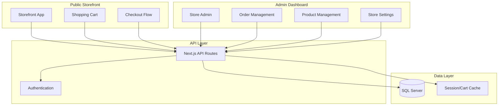

# Design Document - Online Store Feature

## Overview

Tính năng Online Store mở rộng hệ thống SmartInventory hiện tại để hỗ trợ bán hàng trực tuyến. Mỗi Store_Owner có thể tạo nhiều cửa hàng online, mỗi cửa hàng có Storefront riêng với subdomain độc lập. Hệ thống sử dụng kiến trúc multi-tenant với store isolation.

## Architecture

### High-Level Architecture



### URL Structure

- Admin Dashboard: `app.smartinventory.com/stores/{storeId}`
- Storefront: `{store-slug}.smartinventory.com` hoặc custom domain
- API: `api.smartinventory.com/v1/storefront/{storeSlug}`

## Components and Interfaces

### 1. Online Store Configuration

```typescript
interface OnlineStoreConfig {
  id: string;
  storeId: string;              // Reference to parent Store
  slug: string;                 // Unique URL slug
  customDomain?: string;        // Optional custom domain
  isActive: boolean;
  
  // Branding
  storeName: string;
  logo?: string;
  favicon?: string;
  description?: string;
  
  // Theme
  themeId: string;
  primaryColor: string;
  secondaryColor: string;
  fontFamily: string;
  
  // Contact
  contactEmail: string;
  contactPhone?: string;
  address?: string;
  
  // Social
  facebookUrl?: string;
  instagramUrl?: string;
  
  // Settings
  currency: string;
  timezone: string;
  
  createdAt: Date;
  updatedAt: Date;
}
```

### 2. Online Product Catalog

```typescript
interface OnlineProduct {
  id: string;
  onlineStoreId: string;
  productId: string;            // Reference to inventory Product
  
  // Online-specific fields
  isPublished: boolean;
  onlinePrice?: number;         // Override price for online
  onlineDescription?: string;   // Override description
  displayOrder: number;
  
  // SEO
  seoTitle?: string;
  seoDescription?: string;
  seoSlug: string;
  
  // Images (can be different from inventory)
  images: string[];
  
  createdAt: Date;
  updatedAt: Date;
}

interface OnlineCategory {
  id: string;
  onlineStoreId: string;
  name: string;
  slug: string;
  description?: string;
  image?: string;
  parentId?: string;
  displayOrder: number;
  isActive: boolean;
}
```

### 3. Shopping Cart

```typescript
interface ShoppingCart {
  id: string;
  onlineStoreId: string;
  sessionId?: string;           // For guest users
  customerId?: string;          // For logged-in users
  
  items: CartItem[];
  
  subtotal: number;
  discountAmount: number;
  shippingFee: number;
  total: number;
  
  couponCode?: string;
  
  createdAt: Date;
  updatedAt: Date;
  expiresAt: Date;              // Cart expiration (7 days)
}

interface CartItem {
  id: string;
  cartId: string;
  onlineProductId: string;
  quantity: number;
  unitPrice: number;
  totalPrice: number;
}
```

### 4. Online Order

```typescript
interface OnlineOrder {
  id: string;
  orderNumber: string;          // Format: ON{YYYYMMDD}{SEQ}
  onlineStoreId: string;
  
  // Customer info
  customerId?: string;
  customerEmail: string;
  customerName: string;
  customerPhone: string;
  
  // Shipping
  shippingAddress: ShippingAddress;
  shippingMethod: string;
  shippingFee: number;
  trackingNumber?: string;
  carrier?: string;
  estimatedDelivery?: Date;
  
  // Order details
  items: OnlineOrderItem[];
  subtotal: number;
  discountAmount: number;
  total: number;
  
  // Status
  status: OrderStatus;
  paymentStatus: PaymentStatus;
  paymentMethod: PaymentMethod;
  
  // Notes
  customerNote?: string;
  internalNote?: string;
  
  createdAt: Date;
  updatedAt: Date;
  confirmedAt?: Date;
  shippedAt?: Date;
  deliveredAt?: Date;
  cancelledAt?: Date;
}

type OrderStatus = 'pending' | 'confirmed' | 'processing' | 'shipped' | 'delivered' | 'cancelled';
type PaymentStatus = 'pending' | 'paid' | 'refunded' | 'failed';
type PaymentMethod = 'cod' | 'bank_transfer' | 'momo' | 'vnpay' | 'zalopay';

interface OnlineOrderItem {
  id: string;
  orderId: string;
  onlineProductId: string;
  productName: string;
  productSku?: string;
  quantity: number;
  unitPrice: number;
  totalPrice: number;
}

interface ShippingAddress {
  fullName: string;
  phone: string;
  province: string;
  district: string;
  ward: string;
  addressLine: string;
  note?: string;
}
```

### 5. Online Customer

```typescript
interface OnlineCustomer {
  id: string;
  onlineStoreId: string;
  
  email: string;
  passwordHash: string;
  
  firstName: string;
  lastName: string;
  phone?: string;
  
  addresses: CustomerAddress[];
  defaultAddressId?: string;
  
  isActive: boolean;
  isVerified: boolean;
  
  createdAt: Date;
  updatedAt: Date;
  lastLoginAt?: Date;
}

interface CustomerAddress {
  id: string;
  customerId: string;
  label: string;              // "Home", "Office", etc.
  fullName: string;
  phone: string;
  province: string;
  district: string;
  ward: string;
  addressLine: string;
  isDefault: boolean;
}
```

### 6. Shipping Configuration

```typescript
interface ShippingZone {
  id: string;
  onlineStoreId: string;
  name: string;
  provinces: string[];        // List of province codes
  
  flatRate?: number;
  freeShippingThreshold?: number;
  
  isActive: boolean;
}

interface ShippingMethod {
  id: string;
  onlineStoreId: string;
  name: string;
  description?: string;
  estimatedDays: string;      // "2-3 ngày"
  
  baseFee: number;
  feePerKg?: number;
  
  isActive: boolean;
}
```

## Data Models

### Database Schema

```sql
-- Online Store Configuration
CREATE TABLE OnlineStores (
  id UNIQUEIDENTIFIER PRIMARY KEY DEFAULT NEWID(),
  store_id UNIQUEIDENTIFIER NOT NULL,
  slug NVARCHAR(100) NOT NULL UNIQUE,
  custom_domain NVARCHAR(255),
  is_active BIT NOT NULL DEFAULT 1,
  
  store_name NVARCHAR(255) NOT NULL,
  logo NVARCHAR(500),
  favicon NVARCHAR(500),
  description NVARCHAR(MAX),
  
  theme_id NVARCHAR(50) NOT NULL DEFAULT 'default',
  primary_color NVARCHAR(20) DEFAULT '#3B82F6',
  secondary_color NVARCHAR(20) DEFAULT '#10B981',
  font_family NVARCHAR(100) DEFAULT 'Inter',
  
  contact_email NVARCHAR(255) NOT NULL,
  contact_phone NVARCHAR(50),
  address NVARCHAR(500),
  
  facebook_url NVARCHAR(255),
  instagram_url NVARCHAR(255),
  
  currency NVARCHAR(10) DEFAULT 'VND',
  timezone NVARCHAR(50) DEFAULT 'Asia/Ho_Chi_Minh',
  
  created_at DATETIME2 NOT NULL DEFAULT GETDATE(),
  updated_at DATETIME2 NOT NULL DEFAULT GETDATE(),
  
  FOREIGN KEY (store_id) REFERENCES Stores(id)
);

-- Online Products
CREATE TABLE OnlineProducts (
  id UNIQUEIDENTIFIER PRIMARY KEY DEFAULT NEWID(),
  online_store_id UNIQUEIDENTIFIER NOT NULL,
  product_id UNIQUEIDENTIFIER NOT NULL,
  
  is_published BIT NOT NULL DEFAULT 0,
  online_price DECIMAL(18,2),
  online_description NVARCHAR(MAX),
  display_order INT DEFAULT 0,
  
  seo_title NVARCHAR(255),
  seo_description NVARCHAR(500),
  seo_slug NVARCHAR(255) NOT NULL,
  
  images NVARCHAR(MAX),  -- JSON array
  
  created_at DATETIME2 NOT NULL DEFAULT GETDATE(),
  updated_at DATETIME2 NOT NULL DEFAULT GETDATE(),
  
  FOREIGN KEY (online_store_id) REFERENCES OnlineStores(id),
  FOREIGN KEY (product_id) REFERENCES Products(id),
  UNIQUE (online_store_id, seo_slug)
);

-- Online Categories
CREATE TABLE OnlineCategories (
  id UNIQUEIDENTIFIER PRIMARY KEY DEFAULT NEWID(),
  online_store_id UNIQUEIDENTIFIER NOT NULL,
  name NVARCHAR(255) NOT NULL,
  slug NVARCHAR(255) NOT NULL,
  description NVARCHAR(MAX),
  image NVARCHAR(500),
  parent_id UNIQUEIDENTIFIER,
  display_order INT DEFAULT 0,
  is_active BIT NOT NULL DEFAULT 1,
  
  created_at DATETIME2 NOT NULL DEFAULT GETDATE(),
  updated_at DATETIME2 NOT NULL DEFAULT GETDATE(),
  
  FOREIGN KEY (online_store_id) REFERENCES OnlineStores(id),
  FOREIGN KEY (parent_id) REFERENCES OnlineCategories(id),
  UNIQUE (online_store_id, slug)
);

-- Shopping Carts
CREATE TABLE ShoppingCarts (
  id UNIQUEIDENTIFIER PRIMARY KEY DEFAULT NEWID(),
  online_store_id UNIQUEIDENTIFIER NOT NULL,
  session_id NVARCHAR(255),
  customer_id UNIQUEIDENTIFIER,
  
  subtotal DECIMAL(18,2) NOT NULL DEFAULT 0,
  discount_amount DECIMAL(18,2) NOT NULL DEFAULT 0,
  shipping_fee DECIMAL(18,2) NOT NULL DEFAULT 0,
  total DECIMAL(18,2) NOT NULL DEFAULT 0,
  
  coupon_code NVARCHAR(50),
  
  created_at DATETIME2 NOT NULL DEFAULT GETDATE(),
  updated_at DATETIME2 NOT NULL DEFAULT GETDATE(),
  expires_at DATETIME2 NOT NULL,
  
  FOREIGN KEY (online_store_id) REFERENCES OnlineStores(id),
  FOREIGN KEY (customer_id) REFERENCES OnlineCustomers(id)
);

-- Cart Items
CREATE TABLE CartItems (
  id UNIQUEIDENTIFIER PRIMARY KEY DEFAULT NEWID(),
  cart_id UNIQUEIDENTIFIER NOT NULL,
  online_product_id UNIQUEIDENTIFIER NOT NULL,
  quantity INT NOT NULL,
  unit_price DECIMAL(18,2) NOT NULL,
  total_price DECIMAL(18,2) NOT NULL,
  
  created_at DATETIME2 NOT NULL DEFAULT GETDATE(),
  
  FOREIGN KEY (cart_id) REFERENCES ShoppingCarts(id) ON DELETE CASCADE,
  FOREIGN KEY (online_product_id) REFERENCES OnlineProducts(id)
);

-- Online Orders
CREATE TABLE OnlineOrders (
  id UNIQUEIDENTIFIER PRIMARY KEY DEFAULT NEWID(),
  order_number NVARCHAR(50) NOT NULL UNIQUE,
  online_store_id UNIQUEIDENTIFIER NOT NULL,
  
  customer_id UNIQUEIDENTIFIER,
  customer_email NVARCHAR(255) NOT NULL,
  customer_name NVARCHAR(255) NOT NULL,
  customer_phone NVARCHAR(50) NOT NULL,
  
  shipping_address NVARCHAR(MAX) NOT NULL,  -- JSON
  shipping_method NVARCHAR(100),
  shipping_fee DECIMAL(18,2) NOT NULL DEFAULT 0,
  tracking_number NVARCHAR(100),
  carrier NVARCHAR(100),
  estimated_delivery DATETIME2,
  
  subtotal DECIMAL(18,2) NOT NULL,
  discount_amount DECIMAL(18,2) NOT NULL DEFAULT 0,
  total DECIMAL(18,2) NOT NULL,
  
  status NVARCHAR(20) NOT NULL DEFAULT 'pending',
  payment_status NVARCHAR(20) NOT NULL DEFAULT 'pending',
  payment_method NVARCHAR(20) NOT NULL,
  
  customer_note NVARCHAR(MAX),
  internal_note NVARCHAR(MAX),
  
  created_at DATETIME2 NOT NULL DEFAULT GETDATE(),
  updated_at DATETIME2 NOT NULL DEFAULT GETDATE(),
  confirmed_at DATETIME2,
  shipped_at DATETIME2,
  delivered_at DATETIME2,
  cancelled_at DATETIME2,
  
  FOREIGN KEY (online_store_id) REFERENCES OnlineStores(id),
  FOREIGN KEY (customer_id) REFERENCES OnlineCustomers(id)
);

-- Online Order Items
CREATE TABLE OnlineOrderItems (
  id UNIQUEIDENTIFIER PRIMARY KEY DEFAULT NEWID(),
  order_id UNIQUEIDENTIFIER NOT NULL,
  online_product_id UNIQUEIDENTIFIER NOT NULL,
  product_name NVARCHAR(255) NOT NULL,
  product_sku NVARCHAR(100),
  quantity INT NOT NULL,
  unit_price DECIMAL(18,2) NOT NULL,
  total_price DECIMAL(18,2) NOT NULL,
  
  created_at DATETIME2 NOT NULL DEFAULT GETDATE(),
  
  FOREIGN KEY (order_id) REFERENCES OnlineOrders(id) ON DELETE CASCADE,
  FOREIGN KEY (online_product_id) REFERENCES OnlineProducts(id)
);

-- Online Customers
CREATE TABLE OnlineCustomers (
  id UNIQUEIDENTIFIER PRIMARY KEY DEFAULT NEWID(),
  online_store_id UNIQUEIDENTIFIER NOT NULL,
  
  email NVARCHAR(255) NOT NULL,
  password_hash NVARCHAR(255) NOT NULL,
  
  first_name NVARCHAR(100) NOT NULL,
  last_name NVARCHAR(100) NOT NULL,
  phone NVARCHAR(50),
  
  default_address_id UNIQUEIDENTIFIER,
  
  is_active BIT NOT NULL DEFAULT 1,
  is_verified BIT NOT NULL DEFAULT 0,
  
  created_at DATETIME2 NOT NULL DEFAULT GETDATE(),
  updated_at DATETIME2 NOT NULL DEFAULT GETDATE(),
  last_login_at DATETIME2,
  
  FOREIGN KEY (online_store_id) REFERENCES OnlineStores(id),
  UNIQUE (online_store_id, email)
);

-- Customer Addresses
CREATE TABLE CustomerAddresses (
  id UNIQUEIDENTIFIER PRIMARY KEY DEFAULT NEWID(),
  customer_id UNIQUEIDENTIFIER NOT NULL,
  label NVARCHAR(50) NOT NULL,
  full_name NVARCHAR(255) NOT NULL,
  phone NVARCHAR(50) NOT NULL,
  province NVARCHAR(100) NOT NULL,
  district NVARCHAR(100) NOT NULL,
  ward NVARCHAR(100) NOT NULL,
  address_line NVARCHAR(500) NOT NULL,
  is_default BIT NOT NULL DEFAULT 0,
  
  created_at DATETIME2 NOT NULL DEFAULT GETDATE(),
  updated_at DATETIME2 NOT NULL DEFAULT GETDATE(),
  
  FOREIGN KEY (customer_id) REFERENCES OnlineCustomers(id) ON DELETE CASCADE
);

-- Shipping Zones
CREATE TABLE ShippingZones (
  id UNIQUEIDENTIFIER PRIMARY KEY DEFAULT NEWID(),
  online_store_id UNIQUEIDENTIFIER NOT NULL,
  name NVARCHAR(100) NOT NULL,
  provinces NVARCHAR(MAX) NOT NULL,  -- JSON array
  
  flat_rate DECIMAL(18,2),
  free_shipping_threshold DECIMAL(18,2),
  
  is_active BIT NOT NULL DEFAULT 1,
  
  created_at DATETIME2 NOT NULL DEFAULT GETDATE(),
  updated_at DATETIME2 NOT NULL DEFAULT GETDATE(),
  
  FOREIGN KEY (online_store_id) REFERENCES OnlineStores(id)
);
```

## Error Handling

### API Error Responses

```typescript
interface ApiError {
  code: string;
  message: string;
  details?: Record<string, string>;
}

// Error codes
const ErrorCodes = {
  // Store errors
  STORE_NOT_FOUND: 'Cửa hàng không tồn tại',
  STORE_INACTIVE: 'Cửa hàng đang tạm ngưng hoạt động',
  STORE_LIMIT_REACHED: 'Đã đạt giới hạn số cửa hàng',
  
  // Product errors
  PRODUCT_NOT_FOUND: 'Sản phẩm không tồn tại',
  PRODUCT_OUT_OF_STOCK: 'Sản phẩm đã hết hàng',
  PRODUCT_UNAVAILABLE: 'Sản phẩm không khả dụng',
  
  // Cart errors
  CART_EMPTY: 'Giỏ hàng trống',
  CART_EXPIRED: 'Giỏ hàng đã hết hạn',
  INVALID_QUANTITY: 'Số lượng không hợp lệ',
  
  // Order errors
  ORDER_NOT_FOUND: 'Đơn hàng không tồn tại',
  INVALID_ORDER_STATUS: 'Trạng thái đơn hàng không hợp lệ',
  
  // Customer errors
  EMAIL_EXISTS: 'Email đã được sử dụng',
  INVALID_CREDENTIALS: 'Email hoặc mật khẩu không đúng',
  ACCOUNT_INACTIVE: 'Tài khoản đã bị vô hiệu hóa',
};
```

## Testing Strategy

### Unit Tests
- Repository methods for all entities
- Cart calculation logic
- Order status transitions
- Shipping fee calculations

### Integration Tests
- Complete checkout flow
- Order creation and inventory deduction
- Customer registration and login
- Payment status updates

### E2E Tests
- Browse products → Add to cart → Checkout → Order confirmation
- Customer account creation and order history
- Store owner order management workflow
