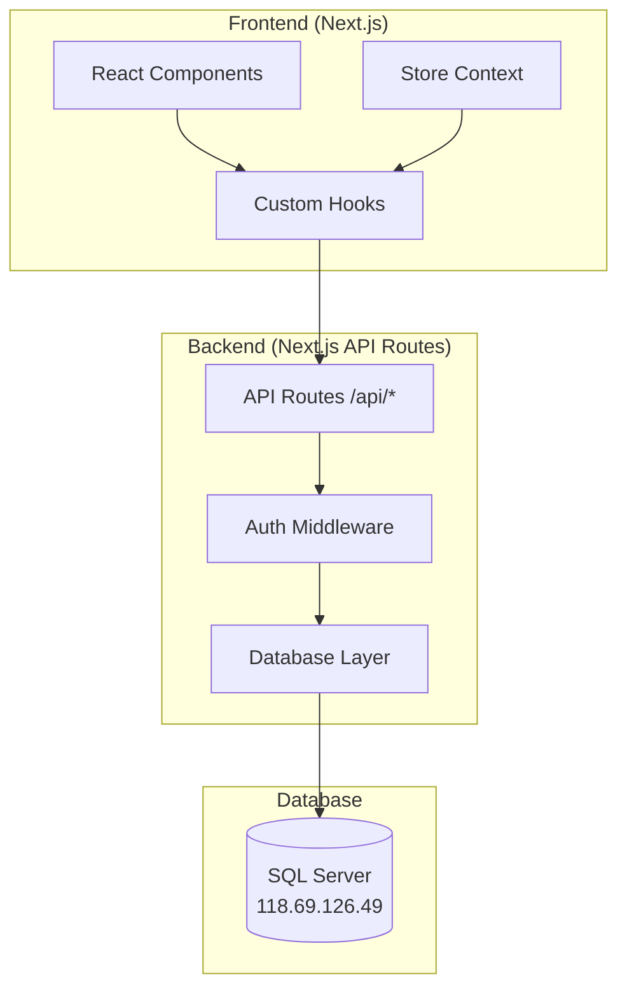
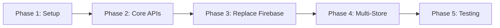

# Design Document: SQL Server Migration with Multi-Store Support

## Overview

Thiết kế này mô tả kiến trúc chuyển đổi SmartInventory từ Firebase sang SQL Server, bổ sung tính năng multi-store. Hệ thống sử dụng Next.js API Routes làm backend, kết nối SQL Server thông qua `mssql` package, và JWT cho authentication.

## Architecture



## Components and Interfaces

### 1. Database Connection Layer

```typescript
// src/lib/db/connection.ts
import sql from 'mssql';

const config: sql.config = {
  server: '118.69.126.49',
  database: 'Data_QuanLyBanHang_Online',
  user: 'userquanlybanhangonline',
  password: '123456789',
  options: {
    encrypt: false,
    trustServerCertificate: true,
  },
  pool: {
    max: 10,
    min: 0,
    idleTimeoutMillis: 30000,
  },
};

let pool: sql.ConnectionPool | null = null;

export async function getConnection(): Promise<sql.ConnectionPool> {
  if (!pool) {
    pool = await sql.connect(config);
  }
  return pool;
}

export async function query<T>(
  queryString: string,
  params?: Record<string, any>
): Promise<T[]> {
  const conn = await getConnection();
  const request = conn.request();
  
  if (params) {
    Object.entries(params).forEach(([key, value]) => {
      request.input(key, value);
    });
  }
  
  const result = await request.query(queryString);
  return result.recordset as T[];
}
```

### 2. Authentication Service

```typescript
// src/lib/auth/auth-service.ts
interface AuthResult {
  success: boolean;
  user?: UserWithStores;
  token?: string;
  error?: string;
}

interface UserWithStores {
  id: string;
  email: string;
  displayName: string;
  role: string;
  stores: Store[];
  permissions: Permissions;
}

export async function login(email: string, password: string): Promise<AuthResult>;
export async function validateToken(token: string): Promise<UserWithStores | null>;
export async function logout(token: string): Promise<void>;
```

### 3. Store Context Provider

```typescript
// src/contexts/store-context.tsx
interface StoreContextType {
  currentStore: Store | null;
  stores: Store[];
  switchStore: (storeId: string) => void;
  isLoading: boolean;
}

export const StoreContext = createContext<StoreContextType | null>(null);
export const useStore = () => useContext(StoreContext);
```

### 4. API Route Structure

```
src/app/api/
├── auth/
│   ├── login/route.ts
│   ├── logout/route.ts
│   └── me/route.ts
├── stores/
│   ├── route.ts (GET all, POST create)
│   └── [storeId]/route.ts (GET, PUT, DELETE)
├── products/
│   ├── route.ts
│   └── [productId]/route.ts
├── sales/
│   ├── route.ts
│   └── [saleId]/route.ts
├── customers/
│   ├── route.ts
│   └── [customerId]/route.ts
├── suppliers/
│   ├── route.ts
│   └── [supplierId]/route.ts
├── categories/
│   └── route.ts
├── units/
│   └── route.ts
├── purchases/
│   ├── route.ts
│   └── [purchaseId]/route.ts
├── payments/
│   └── route.ts
├── cash-flow/
│   └── route.ts
├── shifts/
│   ├── route.ts
│   └── [shiftId]/route.ts
├── reports/
│   ├── sales/route.ts
│   ├── inventory/route.ts
│   ├── debt/route.ts
│   └── profit/route.ts
└── users/
    ├── route.ts
    └── [userId]/route.ts
```

### 5. Repository Pattern

```typescript
// src/lib/repositories/base-repository.ts
export abstract class BaseRepository<T> {
  protected tableName: string;
  
  constructor(tableName: string) {
    this.tableName = tableName;
  }
  
  async findAll(storeId: string, options?: QueryOptions): Promise<T[]>;
  async findById(id: string, storeId: string): Promise<T | null>;
  async create(data: Partial<T>, storeId: string): Promise<T>;
  async update(id: string, data: Partial<T>, storeId: string): Promise<T>;
  async delete(id: string, storeId: string): Promise<boolean>;
}

// src/lib/repositories/product-repository.ts
export class ProductRepository extends BaseRepository<Product> {
  constructor() {
    super('Products');
  }
  
  async findByBarcode(barcode: string, storeId: string): Promise<Product | null>;
  async findByCategory(categoryId: string, storeId: string): Promise<Product[]>;
  async updateStock(productId: string, quantity: number, storeId: string): Promise<void>;
  async getLowStockProducts(storeId: string): Promise<Product[]>;
}
```

## Data Models

### Database Schema (SQL Server)

```sql
-- Stores Table
CREATE TABLE Stores (
    Id UNIQUEIDENTIFIER PRIMARY KEY DEFAULT NEWID(),
    OwnerId UNIQUEIDENTIFIER NOT NULL,
    Name NVARCHAR(255) NOT NULL,
    Code NVARCHAR(50) UNIQUE NOT NULL,
    Address NVARCHAR(500),
    Phone NVARCHAR(20),
    BusinessType NVARCHAR(100),
    Logo NVARCHAR(500),
    Settings NVARCHAR(MAX), -- JSON for ThemeSettings
    CreatedAt DATETIME2 DEFAULT GETDATE(),
    UpdatedAt DATETIME2 DEFAULT GETDATE(),
    Status NVARCHAR(20) DEFAULT 'active'
);

-- Users Table
CREATE TABLE Users (
    Id UNIQUEIDENTIFIER PRIMARY KEY DEFAULT NEWID(),
    Email NVARCHAR(255) UNIQUE NOT NULL,
    PasswordHash NVARCHAR(255) NOT NULL,
    DisplayName NVARCHAR(255),
    Role NVARCHAR(50) NOT NULL,
    Permissions NVARCHAR(MAX), -- JSON
    CreatedAt DATETIME2 DEFAULT GETDATE(),
    UpdatedAt DATETIME2 DEFAULT GETDATE(),
    Status NVARCHAR(20) DEFAULT 'active',
    FailedLoginAttempts INT DEFAULT 0,
    LockedUntil DATETIME2 NULL
);

-- UserStores (Many-to-Many)
CREATE TABLE UserStores (
    UserId UNIQUEIDENTIFIER NOT NULL,
    StoreId UNIQUEIDENTIFIER NOT NULL,
    Role NVARCHAR(50), -- Override role per store
    Permissions NVARCHAR(MAX), -- Override permissions per store
    PRIMARY KEY (UserId, StoreId),
    FOREIGN KEY (UserId) REFERENCES Users(Id),
    FOREIGN KEY (StoreId) REFERENCES Stores(Id)
);

-- Categories Table
CREATE TABLE Categories (
    Id UNIQUEIDENTIFIER PRIMARY KEY DEFAULT NEWID(),
    StoreId UNIQUEIDENTIFIER NOT NULL,
    Name NVARCHAR(255) NOT NULL,
    Description NVARCHAR(500),
    FOREIGN KEY (StoreId) REFERENCES Stores(Id)
);

-- Units Table
CREATE TABLE Units (
    Id UNIQUEIDENTIFIER PRIMARY KEY DEFAULT NEWID(),
    StoreId UNIQUEIDENTIFIER NOT NULL,
    Name NVARCHAR(100) NOT NULL,
    Description NVARCHAR(255),
    BaseUnitId UNIQUEIDENTIFIER NULL,
    ConversionFactor DECIMAL(18,4) DEFAULT 1,
    FOREIGN KEY (StoreId) REFERENCES Stores(Id),
    FOREIGN KEY (BaseUnitId) REFERENCES Units(Id)
);

-- Products Table
CREATE TABLE Products (
    Id UNIQUEIDENTIFIER PRIMARY KEY DEFAULT NEWID(),
    StoreId UNIQUEIDENTIFIER NOT NULL,
    Name NVARCHAR(255) NOT NULL,
    Barcode NVARCHAR(100),
    Description NVARCHAR(MAX),
    CategoryId UNIQUEIDENTIFIER NOT NULL,
    UnitId UNIQUEIDENTIFIER NOT NULL,
    SellingPrice DECIMAL(18,2),
    Status NVARCHAR(20) DEFAULT 'active',
    LowStockThreshold INT DEFAULT 10,
    CreatedAt DATETIME2 DEFAULT GETDATE(),
    UpdatedAt DATETIME2 DEFAULT GETDATE(),
    FOREIGN KEY (StoreId) REFERENCES Stores(Id),
    FOREIGN KEY (CategoryId) REFERENCES Categories(Id),
    FOREIGN KEY (UnitId) REFERENCES Units(Id)
);

-- PurchaseLots Table (for FIFO inventory)
CREATE TABLE PurchaseLots (
    Id UNIQUEIDENTIFIER PRIMARY KEY DEFAULT NEWID(),
    ProductId UNIQUEIDENTIFIER NOT NULL,
    StoreId UNIQUEIDENTIFIER NOT NULL,
    ImportDate DATETIME2 NOT NULL,
    Quantity DECIMAL(18,4) NOT NULL,
    RemainingQuantity DECIMAL(18,4) NOT NULL,
    Cost DECIMAL(18,2) NOT NULL,
    UnitId UNIQUEIDENTIFIER NOT NULL,
    PurchaseOrderId UNIQUEIDENTIFIER,
    FOREIGN KEY (ProductId) REFERENCES Products(Id),
    FOREIGN KEY (StoreId) REFERENCES Stores(Id)
);

-- Suppliers Table
CREATE TABLE Suppliers (
    Id UNIQUEIDENTIFIER PRIMARY KEY DEFAULT NEWID(),
    StoreId UNIQUEIDENTIFIER NOT NULL,
    Name NVARCHAR(255) NOT NULL,
    ContactPerson NVARCHAR(255),
    Email NVARCHAR(255),
    Phone NVARCHAR(20),
    Address NVARCHAR(500),
    TaxCode NVARCHAR(50),
    Notes NVARCHAR(MAX),
    CreatedAt DATETIME2 DEFAULT GETDATE(),
    UpdatedAt DATETIME2 DEFAULT GETDATE(),
    FOREIGN KEY (StoreId) REFERENCES Stores(Id)
);

-- Customers Table
CREATE TABLE Customers (
    Id UNIQUEIDENTIFIER PRIMARY KEY DEFAULT NEWID(),
    StoreId UNIQUEIDENTIFIER NOT NULL,
    Name NVARCHAR(255) NOT NULL,
    Email NVARCHAR(255),
    Phone NVARCHAR(20),
    Address NVARCHAR(500),
    CustomerType NVARCHAR(20) DEFAULT 'personal',
    CustomerGroup NVARCHAR(100),
    Gender NVARCHAR(10),
    Birthday DATE,
    Zalo NVARCHAR(50),
    BankName NVARCHAR(255),
    BankAccountNumber NVARCHAR(50),
    BankBranch NVARCHAR(255),
    CreditLimit DECIMAL(18,2) DEFAULT 0,
    CurrentDebt DECIMAL(18,2) DEFAULT 0,
    LoyaltyPoints INT DEFAULT 0,
    LifetimePoints INT DEFAULT 0,
    LoyaltyTier NVARCHAR(20) DEFAULT 'bronze',
    Status NVARCHAR(20) DEFAULT 'active',
    CreatedAt DATETIME2 DEFAULT GETDATE(),
    UpdatedAt DATETIME2 DEFAULT GETDATE(),
    FOREIGN KEY (StoreId) REFERENCES Stores(Id)
);

-- Sales Table
CREATE TABLE Sales (
    Id UNIQUEIDENTIFIER PRIMARY KEY DEFAULT NEWID(),
    StoreId UNIQUEIDENTIFIER NOT NULL,
    InvoiceNumber NVARCHAR(50) UNIQUE NOT NULL,
    CustomerId UNIQUEIDENTIFIER,
    ShiftId UNIQUEIDENTIFIER,
    TransactionDate DATETIME2 NOT NULL,
    Status NVARCHAR(20) DEFAULT 'pending',
    TotalAmount DECIMAL(18,2) NOT NULL,
    VatAmount DECIMAL(18,2) DEFAULT 0,
    FinalAmount DECIMAL(18,2) NOT NULL,
    Discount DECIMAL(18,2) DEFAULT 0,
    DiscountType NVARCHAR(20),
    DiscountValue DECIMAL(18,2),
    TierDiscountPercentage DECIMAL(5,2),
    TierDiscountAmount DECIMAL(18,2),
    PointsUsed INT DEFAULT 0,
    PointsDiscount DECIMAL(18,2) DEFAULT 0,
    CustomerPayment DECIMAL(18,2),
    PreviousDebt DECIMAL(18,2),
    RemainingDebt DECIMAL(18,2),
    CreatedBy UNIQUEIDENTIFIER,
    CreatedAt DATETIME2 DEFAULT GETDATE(),
    FOREIGN KEY (StoreId) REFERENCES Stores(Id),
    FOREIGN KEY (CustomerId) REFERENCES Customers(Id)
);

-- SalesItems Table
CREATE TABLE SalesItems (
    Id UNIQUEIDENTIFIER PRIMARY KEY DEFAULT NEWID(),
    SalesId UNIQUEIDENTIFIER NOT NULL,
    ProductId UNIQUEIDENTIFIER NOT NULL,
    Quantity DECIMAL(18,4) NOT NULL,
    Price DECIMAL(18,2) NOT NULL,
    Cost DECIMAL(18,2), -- For profit calculation
    FOREIGN KEY (SalesId) REFERENCES Sales(Id) ON DELETE CASCADE,
    FOREIGN KEY (ProductId) REFERENCES Products(Id)
);

-- PurchaseOrders Table
CREATE TABLE PurchaseOrders (
    Id UNIQUEIDENTIFIER PRIMARY KEY DEFAULT NEWID(),
    StoreId UNIQUEIDENTIFIER NOT NULL,
    OrderNumber NVARCHAR(50) UNIQUE NOT NULL,
    SupplierId UNIQUEIDENTIFIER,
    ImportDate DATETIME2 NOT NULL,
    TotalAmount DECIMAL(18,2) NOT NULL,
    Notes NVARCHAR(MAX),
    CreatedBy UNIQUEIDENTIFIER,
    CreatedAt DATETIME2 DEFAULT GETDATE(),
    FOREIGN KEY (StoreId) REFERENCES Stores(Id),
    FOREIGN KEY (SupplierId) REFERENCES Suppliers(Id)
);

-- PurchaseOrderItems Table
CREATE TABLE PurchaseOrderItems (
    Id UNIQUEIDENTIFIER PRIMARY KEY DEFAULT NEWID(),
    PurchaseOrderId UNIQUEIDENTIFIER NOT NULL,
    ProductId UNIQUEIDENTIFIER NOT NULL,
    Quantity DECIMAL(18,4) NOT NULL,
    Cost DECIMAL(18,2) NOT NULL,
    UnitId UNIQUEIDENTIFIER NOT NULL,
    FOREIGN KEY (PurchaseOrderId) REFERENCES PurchaseOrders(Id) ON DELETE CASCADE,
    FOREIGN KEY (ProductId) REFERENCES Products(Id)
);

-- Payments Table (Customer Payments)
CREATE TABLE Payments (
    Id UNIQUEIDENTIFIER PRIMARY KEY DEFAULT NEWID(),
    StoreId UNIQUEIDENTIFIER NOT NULL,
    CustomerId UNIQUEIDENTIFIER NOT NULL,
    PaymentDate DATETIME2 NOT NULL,
    Amount DECIMAL(18,2) NOT NULL,
    Notes NVARCHAR(MAX),
    CreatedBy UNIQUEIDENTIFIER,
    CreatedAt DATETIME2 DEFAULT GETDATE(),
    FOREIGN KEY (StoreId) REFERENCES Stores(Id),
    FOREIGN KEY (CustomerId) REFERENCES Customers(Id)
);

-- SupplierPayments Table
CREATE TABLE SupplierPayments (
    Id UNIQUEIDENTIFIER PRIMARY KEY DEFAULT NEWID(),
    StoreId UNIQUEIDENTIFIER NOT NULL,
    SupplierId UNIQUEIDENTIFIER NOT NULL,
    PaymentDate DATETIME2 NOT NULL,
    Amount DECIMAL(18,2) NOT NULL,
    Notes NVARCHAR(MAX),
    CreatedBy UNIQUEIDENTIFIER,
    CreatedAt DATETIME2 DEFAULT GETDATE(),
    FOREIGN KEY (StoreId) REFERENCES Stores(Id),
    FOREIGN KEY (SupplierId) REFERENCES Suppliers(Id)
);

-- CashTransactions Table
CREATE TABLE CashTransactions (
    Id UNIQUEIDENTIFIER PRIMARY KEY DEFAULT NEWID(),
    StoreId UNIQUEIDENTIFIER NOT NULL,
    Type NVARCHAR(10) NOT NULL, -- 'thu' or 'chi'
    TransactionDate DATETIME2 NOT NULL,
    Amount DECIMAL(18,2) NOT NULL,
    Reason NVARCHAR(500) NOT NULL,
    Category NVARCHAR(100),
    RelatedInvoiceId UNIQUEIDENTIFIER,
    CreatedBy UNIQUEIDENTIFIER,
    CreatedAt DATETIME2 DEFAULT GETDATE(),
    FOREIGN KEY (StoreId) REFERENCES Stores(Id)
);

-- Shifts Table
CREATE TABLE Shifts (
    Id UNIQUEIDENTIFIER PRIMARY KEY DEFAULT NEWID(),
    StoreId UNIQUEIDENTIFIER NOT NULL,
    UserId UNIQUEIDENTIFIER NOT NULL,
    UserName NVARCHAR(255),
    Status NVARCHAR(20) DEFAULT 'active',
    StartTime DATETIME2 NOT NULL,
    EndTime DATETIME2,
    StartingCash DECIMAL(18,2) NOT NULL,
    EndingCash DECIMAL(18,2),
    CashSales DECIMAL(18,2) DEFAULT 0,
    CashPayments DECIMAL(18,2) DEFAULT 0,
    TotalCashInDrawer DECIMAL(18,2),
    CashDifference DECIMAL(18,2),
    TotalRevenue DECIMAL(18,2) DEFAULT 0,
    SalesCount INT DEFAULT 0,
    FOREIGN KEY (StoreId) REFERENCES Stores(Id),
    FOREIGN KEY (UserId) REFERENCES Users(Id)
);

-- AuditLogs Table
CREATE TABLE AuditLogs (
    Id UNIQUEIDENTIFIER PRIMARY KEY DEFAULT NEWID(),
    StoreId UNIQUEIDENTIFIER,
    UserId UNIQUEIDENTIFIER,
    Action NVARCHAR(100) NOT NULL,
    TableName NVARCHAR(100),
    RecordId UNIQUEIDENTIFIER,
    OldValues NVARCHAR(MAX),
    NewValues NVARCHAR(MAX),
    IpAddress NVARCHAR(50),
    CreatedAt DATETIME2 DEFAULT GETDATE()
);

-- Sessions Table (for JWT management)
CREATE TABLE Sessions (
    Id UNIQUEIDENTIFIER PRIMARY KEY DEFAULT NEWID(),
    UserId UNIQUEIDENTIFIER NOT NULL,
    Token NVARCHAR(500) NOT NULL,
    ExpiresAt DATETIME2 NOT NULL,
    CreatedAt DATETIME2 DEFAULT GETDATE(),
    FOREIGN KEY (UserId) REFERENCES Users(Id)
);
```

### TypeScript Types (Updated)

```typescript
// src/lib/types.ts

export interface Store {
  id: string;
  ownerId: string;
  name: string;
  code: string;
  address?: string;
  phone?: string;
  businessType?: string;
  logo?: string;
  settings?: ThemeSettings;
  createdAt: string;
  updatedAt: string;
  status: 'active' | 'inactive';
}

export interface UserWithStores extends AppUser {
  stores: Store[];
  currentStoreId?: string;
}

// All existing types remain the same but add storeId
export interface Product {
  id: string;
  storeId: string; // NEW
  name: string;
  barcode?: string;
  description?: string;
  categoryId: string;
  unitId: string;
  sellingPrice?: number;
  status: 'active' | 'draft' | 'archived';
  lowStockThreshold?: number;
  createdAt: string;
  updatedAt: string;
}

// Similar pattern for all other entities...
```

## Error Handling

### API Error Response Format

```typescript
interface ApiError {
  code: string;
  message: string;
  details?: Record<string, any>;
}

// Error codes
const ErrorCodes = {
  UNAUTHORIZED: 'UNAUTHORIZED',
  FORBIDDEN: 'FORBIDDEN',
  NOT_FOUND: 'NOT_FOUND',
  VALIDATION_ERROR: 'VALIDATION_ERROR',
  DATABASE_ERROR: 'DATABASE_ERROR',
  DUPLICATE_ENTRY: 'DUPLICATE_ENTRY',
  INSUFFICIENT_STOCK: 'INSUFFICIENT_STOCK',
  CREDIT_LIMIT_EXCEEDED: 'CREDIT_LIMIT_EXCEEDED',
};
```

### Database Transaction Handling

```typescript
export async function withTransaction<T>(
  callback: (transaction: sql.Transaction) => Promise<T>
): Promise<T> {
  const conn = await getConnection();
  const transaction = new sql.Transaction(conn);
  
  try {
    await transaction.begin();
    const result = await callback(transaction);
    await transaction.commit();
    return result;
  } catch (error) {
    await transaction.rollback();
    throw error;
  }
}
```

## Testing Strategy

### Unit Tests
- Repository methods với mock database
- Authentication service
- Utility functions (invoice number generation, FIFO calculation)

### Integration Tests
- API routes với test database
- Database transactions
- Multi-store data isolation

### E2E Tests
- Login flow
- Store switching
- Complete sales transaction
- Report generation

## Security Considerations

1. **SQL Injection Prevention**: Sử dụng parameterized queries
2. **Password Hashing**: bcrypt với 10+ salt rounds
3. **JWT Security**: 
   - Token expiration (24h)
   - Secure HTTP-only cookies
   - Token blacklisting on logout
4. **Store Isolation**: Middleware kiểm tra storeId trên mọi request
5. **Rate Limiting**: Giới hạn login attempts
6. **Audit Logging**: Ghi log mọi thao tác quan trọng

## Migration Strategy



1. **Phase 1**: Setup SQL Server connection, create tables
2. **Phase 2**: Implement API routes và repositories
3. **Phase 3**: Replace Firebase hooks với SQL Server hooks
4. **Phase 4**: Add multi-store functionality
5. **Phase 5**: Testing và data migration
